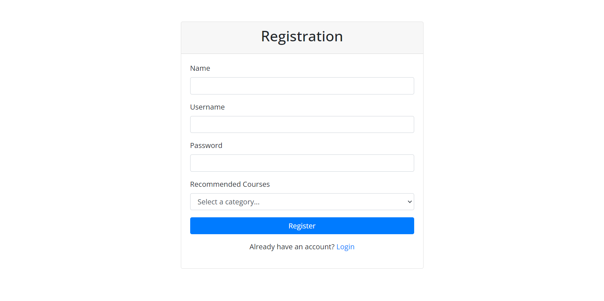
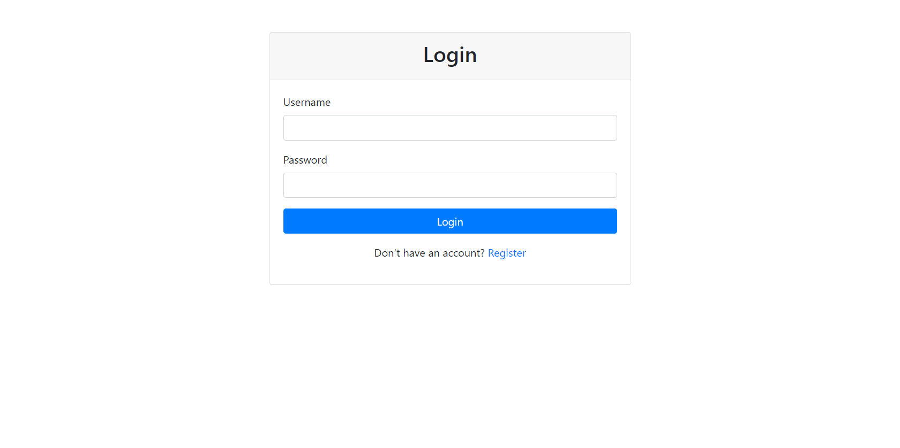
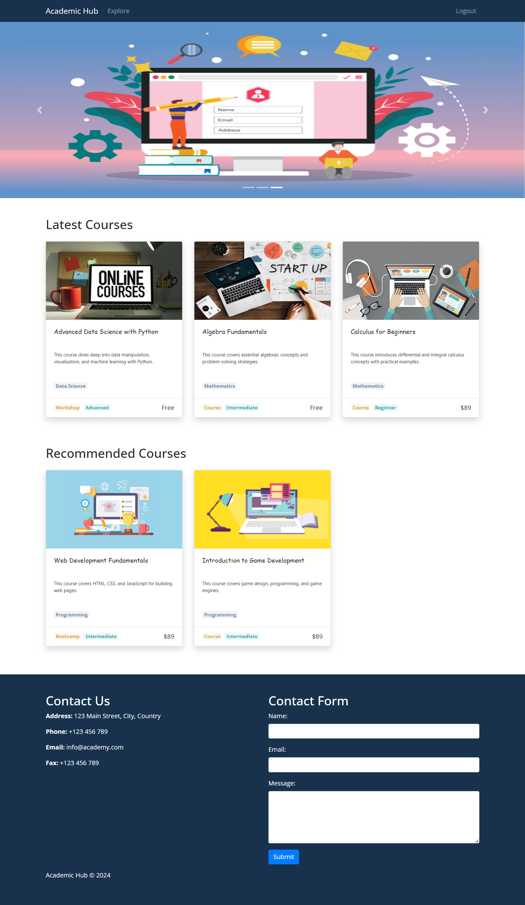
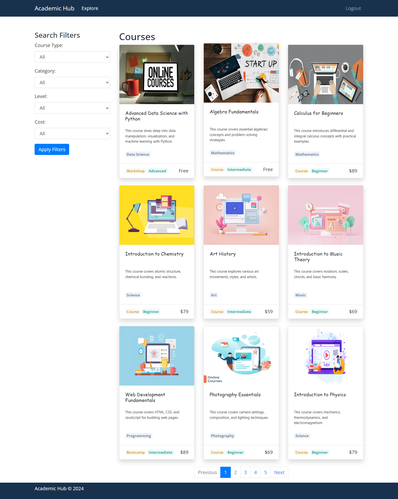
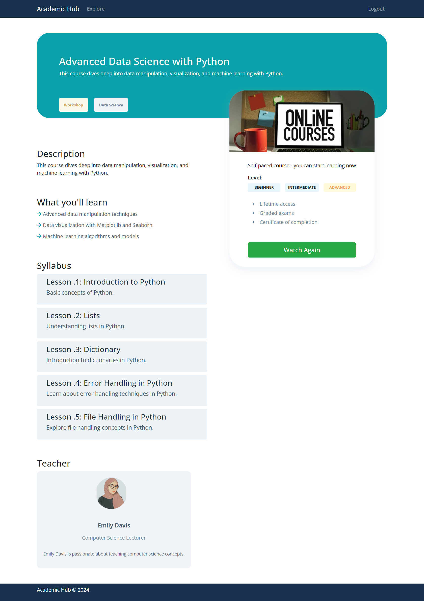
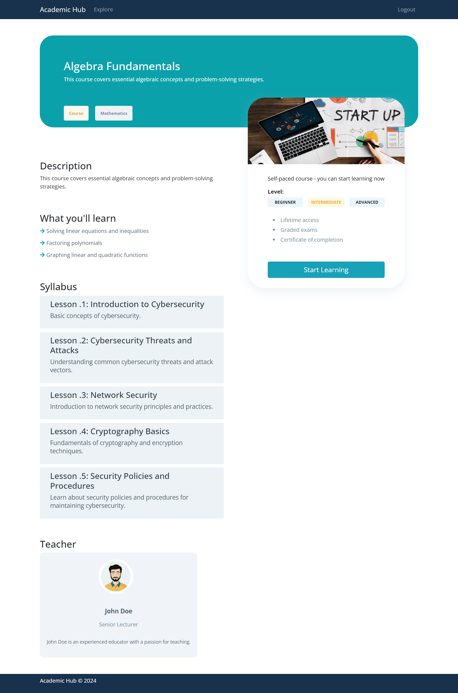
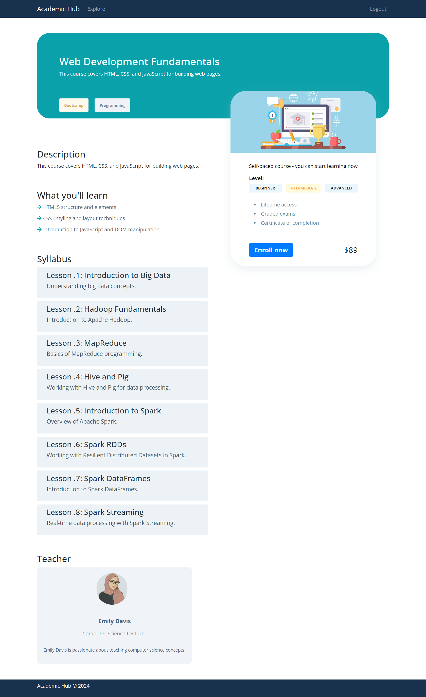
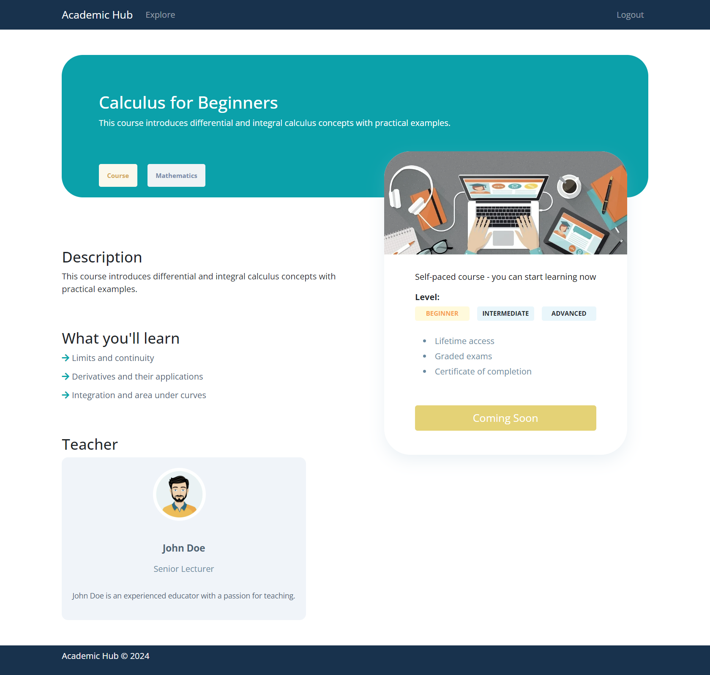
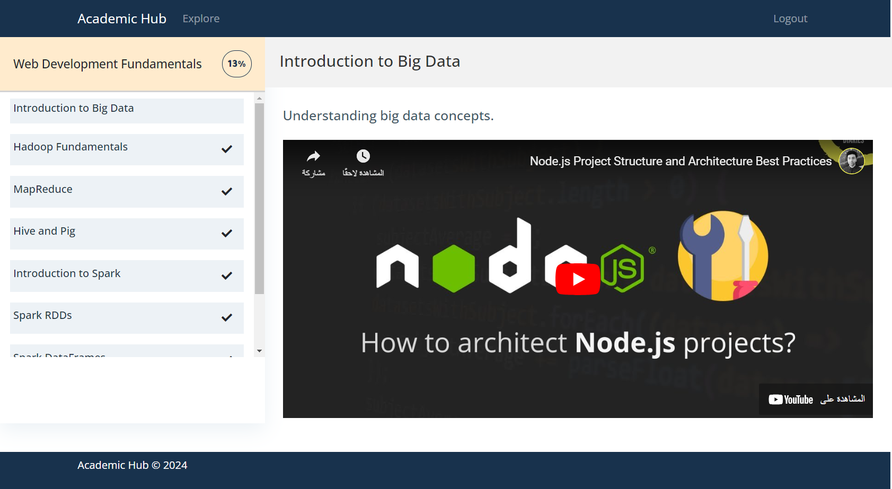

# Academic Hub

**Academic Hub** is a platform designed to facilitate academic collaboration, resource sharing, and knowledge exchange. It serves students, educators, and researchers seeking a centralized hub for accessing academic content, managing research, and connecting with peers and mentors.

## Technologies

- **Frontend**: HTML, CSS, Bootstrap
- **Backend**: PHP
- **Database**: MySQL
- **Development Environment**: XAMPP

## Getting Started

To get started with the project, follow the steps below:

### Prerequisites

Ensure you have the following installed:

- [XAMPP](https://www.apachefriends.org/index.html) (for running PHP and MySQL)

### Installation

1. Clone the repository:

    ```bash
    git clone https://github.com/ameentalahmeh/academic-hub
    ```

2. Navigate to the project directory:

    ```bash
    cd academic-hub
    ```

3. Place the project folder in the `htdocs` directory of your XAMPP installation (e.g., `C:\xampp\htdocs\academic-hub`).

4. Start the XAMPP control panel and ensure Apache and MySQL services are running.

5. Create a `.env` file in the root of your project directory with the following content:

    ```env
    DB_HOST=localhost
    DB_USER=root
    DB_PASS=
    DB_NAME=academy
    ```

6. Initialize the database by importing the `academy.sql` file:
   - Open phpMyAdmin by navigating to `http://localhost/phpmyadmin`.
   - Create a new database named `academy`.
   - Import the `db/models/academy.sql` file to set up the database structure.

7. Insert mock records into the tables by importing the `insert_mock.sql` file:
   - In phpMyAdmin, select the `academy` database.
   - Import the `db/models/insert_mock.sql` file to populate the database with initial data.

8. Access the application:
   - Open your web browser and navigate to `http://localhost/academic-hub`.

## Screenshots

Here are some screenshots showcasing the **Academic Hub** application:

### Registration Page


### Login Page


### Home Page


### Courses Page


### Enrolled Course


### Ongoing Course


### Open Course


### Coming Soon Course


### Learn Page

